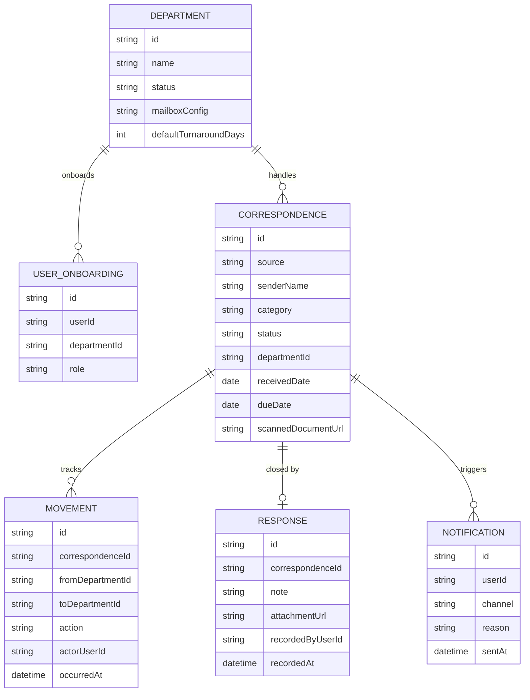

# Domain Model

The system tracks each correspondence item from intake through routing,
handling, and closure, organized around departments and the people onboarded
into them.

- **Department** is managed by an Admin: created, renamed, deactivated, and
given its own intake mailbox configuration and default turnaround period
(which may be overridden per correspondence category).
- **User Onboarding** records the department and role (Registry Officer,
Department Officer, or Supervisor) a Thunder-authenticated identity holds
in this app; a user holds exactly one such membership at a time.
- **Correspondence** is the tracked item — logged manually or captured from
email — carrying its current department, status, and due date.
- **Movement** is the audit trail: every routing, reassignment, and status
change against a correspondence item.
- **Response** is the recorded resolution (note and/or attached document)
required before an item can be closed.
- **Notification** records an assignment or overdue alert sent to a user on
one of the three channels.

