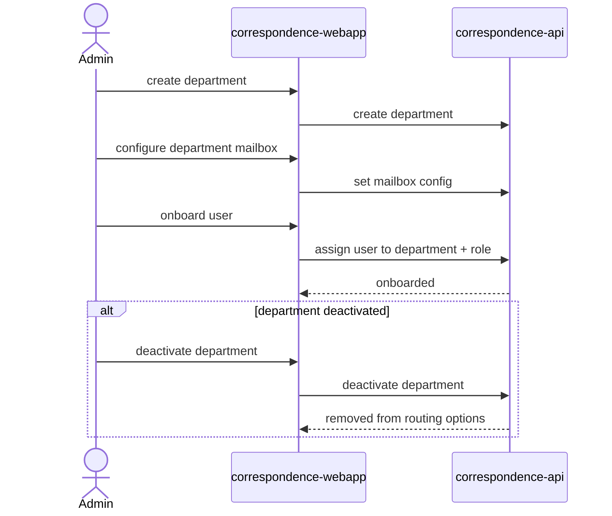

# Admin Onboarding

An Admin manages the department directory — including each department's
intake mailbox — and onboards users into a department and role.

```mermaid
sequenceDiagram
    actor Admin
    participant correspondencewebapp as correspondence-webapp
    participant correspondenceapi as correspondence-api

    Admin->>correspondencewebapp: create department
    correspondencewebapp->>correspondenceapi: create department
    Admin->>correspondencewebapp: configure department mailbox
    correspondencewebapp->>correspondenceapi: set mailbox config

    Admin->>correspondencewebapp: onboard user
    correspondencewebapp->>correspondenceapi: assign user to department + role
    correspondenceapi-->>correspondencewebapp: onboarded

    alt department deactivated
        Admin->>correspondencewebapp: deactivate department
        correspondencewebapp->>correspondenceapi: deactivate department
        correspondenceapi-->>correspondencewebapp: removed from routing options
    end
```