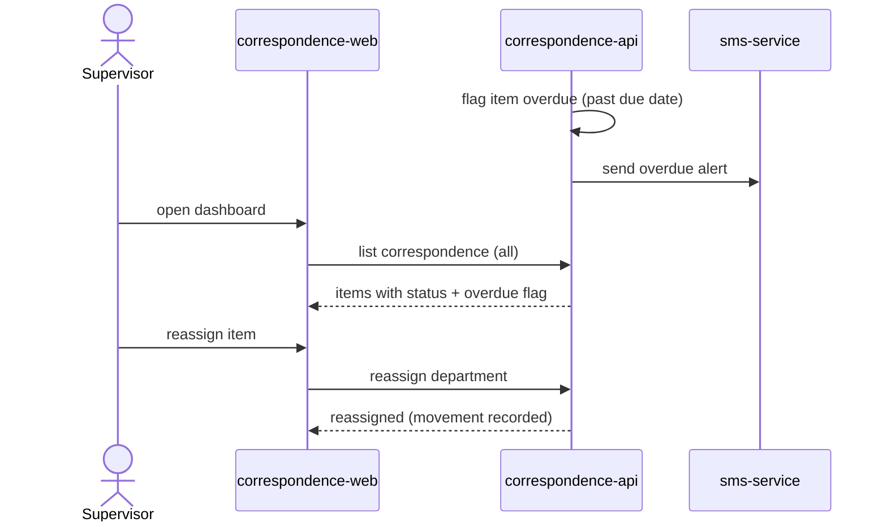

# Escalation and Reassignment

A Supervisor monitors overall status, sees items flagged overdue, and
reassigns correspondence to rebalance or correct workload.

```mermaid
sequenceDiagram
    actor Supervisor
    participant correspondenceweb as correspondence-web
    participant correspondenceapi as correspondence-api
    participant smsservice as sms-service

    correspondenceapi->>correspondenceapi: flag item overdue (past due date)
    correspondenceapi->>smsservice: send overdue alert

    Supervisor->>correspondenceweb: open dashboard
    correspondenceweb->>correspondenceapi: list correspondence (all)
    correspondenceapi-->>correspondenceweb: items with status + overdue flag

    Supervisor->>correspondenceweb: reassign item
    correspondenceweb->>correspondenceapi: reassign department
    correspondenceapi-->>correspondenceweb: reassigned (movement recorded)
```