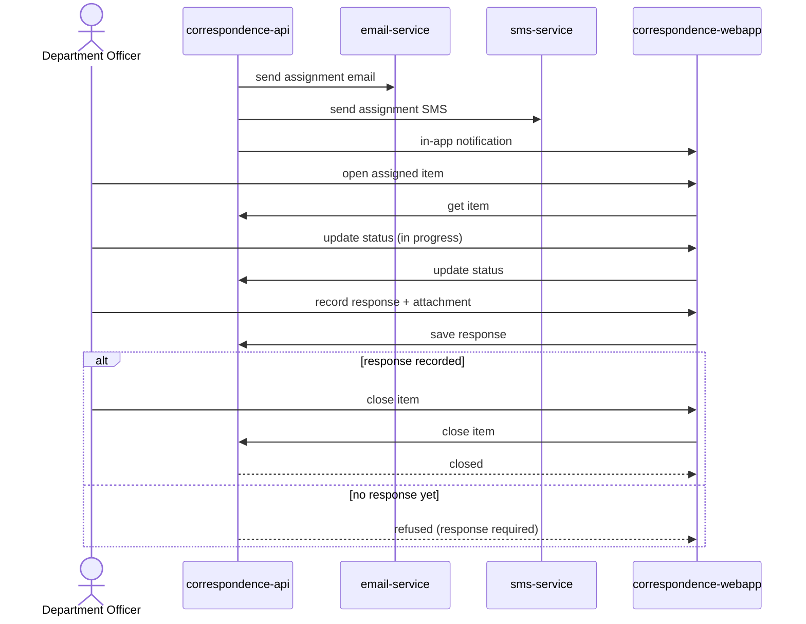

# Handling and Closure

A Department Officer is notified of a newly assigned item, works it, records
a response, and closes it once resolved.

```mermaid
sequenceDiagram
    actor DepartmentOfficer as Department Officer
    participant correspondenceapi as correspondence-api
    participant emailservice as email-service
    participant smsservice as sms-service
    participant correspondencewebapp as correspondence-webapp

    correspondenceapi->>emailservice: send assignment email
    correspondenceapi->>smsservice: send assignment SMS
    correspondenceapi->>correspondencewebapp: in-app notification

    DepartmentOfficer->>correspondencewebapp: open assigned item
    correspondencewebapp->>correspondenceapi: get item
    DepartmentOfficer->>correspondencewebapp: update status (in progress)
    correspondencewebapp->>correspondenceapi: update status

    DepartmentOfficer->>correspondencewebapp: record response + attachment
    correspondencewebapp->>correspondenceapi: save response

    alt response recorded
        DepartmentOfficer->>correspondencewebapp: close item
        correspondencewebapp->>correspondenceapi: close item
        correspondenceapi-->>correspondencewebapp: closed
    else no response yet
        correspondenceapi-->>correspondencewebapp: refused (response required)
    end
```

