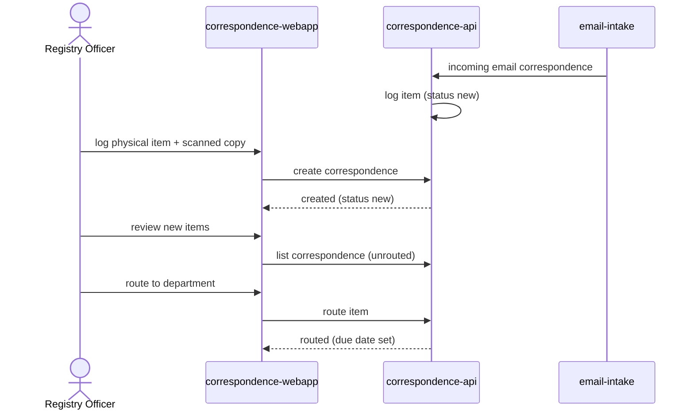

# Intake and Routing

A Registry Officer logs physical correspondence, or the system captures it
automatically from a configured mailbox, and the Registry Officer routes each
new item to the responsible department.

